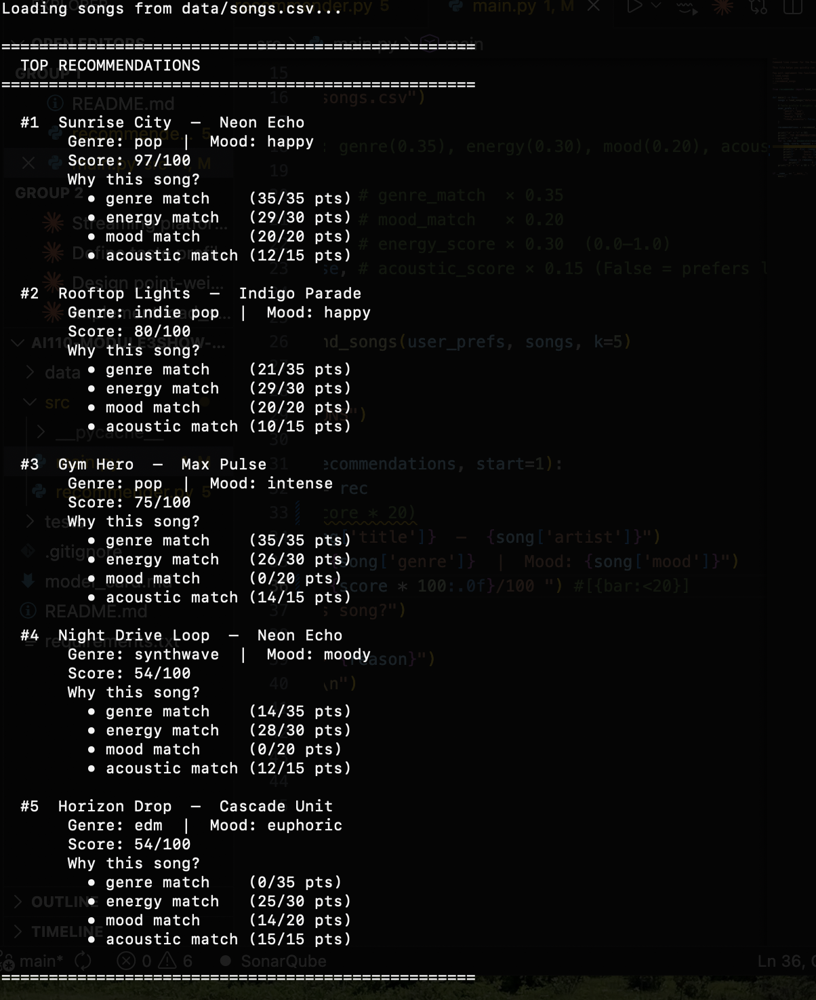
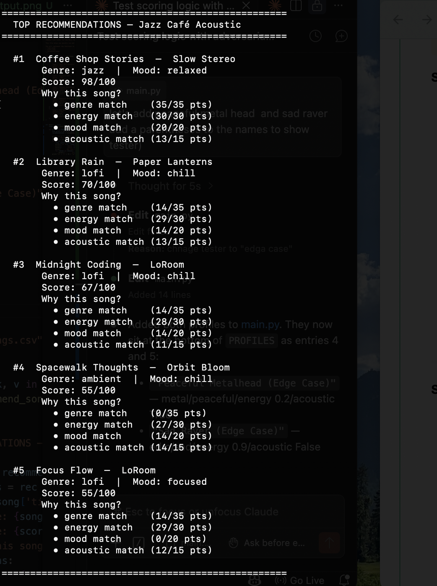
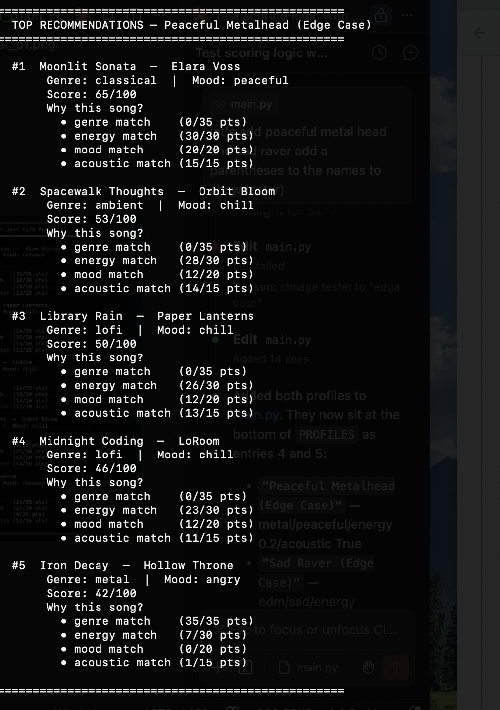
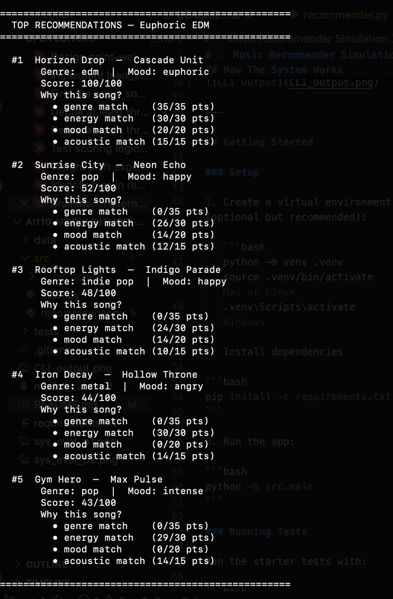
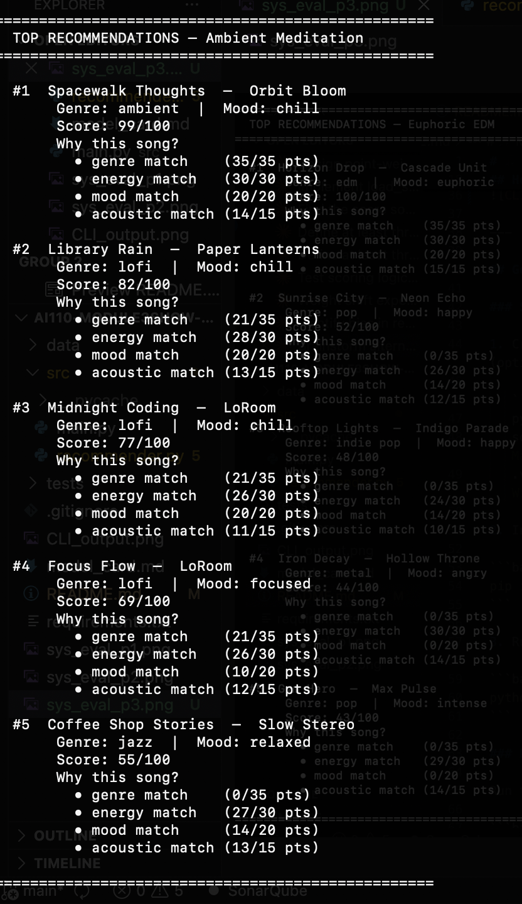
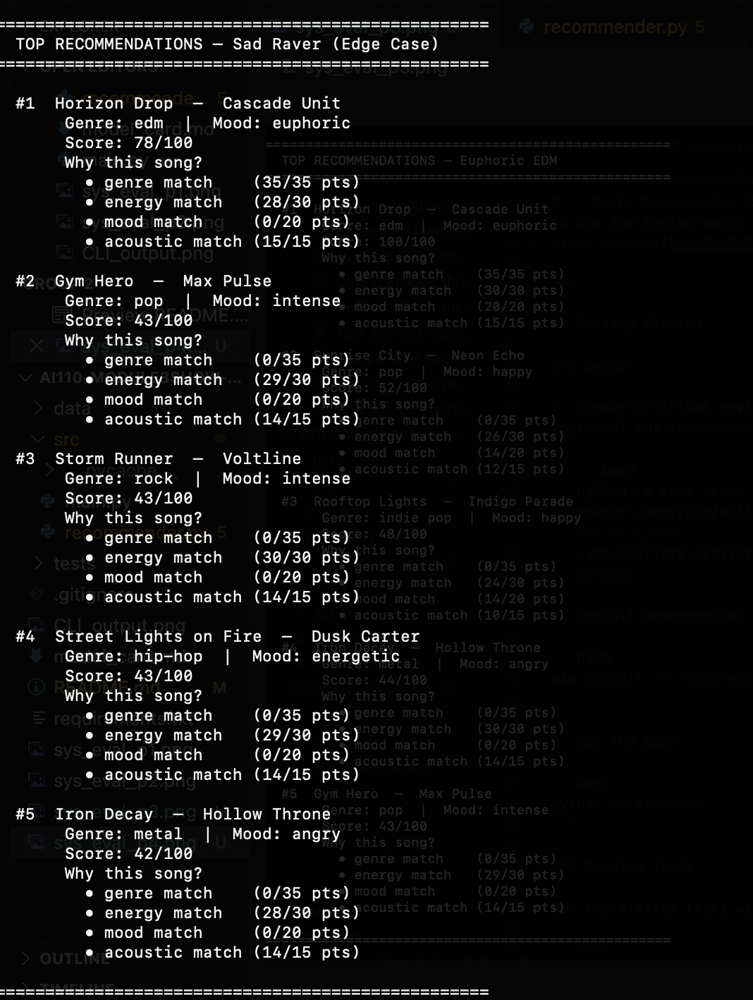

# 🎵 Music Recommender Simulation

## Project Summary

In this project you will build and explain a small music recommender system.

Your goal is to:

- Represent songs and a user "taste profile" as data
- Design a scoring rule that turns that data into recommendations
- Evaluate what your system gets right and wrong
- Reflect on how this mirrors real world AI recommenders

For my version, I built a recommender called Melody Match that scores songs based on four things: genre, mood, energy level, and whether the song is acoustic. I added soft-matching so that similar genres like pop and indie pop still get partial credit instead of a zero, which made the results feel way more natural. I also added five sad EDM songs to the catalog to test edge cases where the mood and genre point in different directions. Building this showed me that even a small formula has real tradeoffs — changing one weight helps some users but breaks results for others, which is exactly how real apps like Spotify have to think.

---

## How The System Works

Explain your design in plain language.

Some prompts to answer:

- What features does each `Song` use in your system
  - For example: genre, mood, energy, tempo
- What information does your `UserProfile` store
- How does your `Recommender` compute a score for each song
- How do you choose which songs to recommend

You can include a simple diagram or bullet list if helpful.

Each `Song` uses four features: `genre`, `mood`, `energy`, and `acousticness`. The `UserProfile` stores a preferred genre, preferred mood, a target energy level (0–1), and a boolean for whether the user likes acoustic music. The `Recommender` scores each song using a weighted sum — genre match is worth 35%, energy proximity 30%, mood match 20%, and acousticness match 15% — so the total score is always between 0 and 1. Songs are then ranked by score and the top k results are returned as recommendations.

**Algorithm Recipe:** For each song, compute `score = genre_match × 0.35 + energy_proximity × 0.30 + mood_match × 0.20 + acoustic_match × 0.15`, where genre and mood matches use soft similarity tables so adjacent styles earn partial credit instead of zero. The 20 scored songs are sorted descending and the top k are returned. A known bias of this weighting is that genre can override mood — a user who is feeling melancholic may still receive high-energy songs simply because their preferred genre matches, even though a better emotional fit exists in a different genre.



---

## Getting Started

### Setup

1. Create a virtual environment (optional but recommended):

   ```bash
   python -m venv .venv
   source .venv/bin/activate      # Mac or Linux
   .venv\Scripts\activate         # Windows

2. Install dependencies

```bash
pip install -r requirements.txt
```

3. Run the app:

```bash
python -m src.main
```

### Running Tests

Run the starter tests with:

```bash
pytest
```

You can add more tests in `tests/test_recommender.py`.

---

## Experiments You Tried

Use this section to document the experiments you ran. For example:

- What happened when you changed the weight on genre from 2.0 to 0.5
- What happened when you added tempo or valence to the score
- How did your system behave for different types of users

When I bumped the genre weight up, the results got more consistent for common genres like pop and lofi — but niche users basically got stuck seeing the same one or two songs on repeat. I also tested a sad EDM profile, which was the most interesting case because the genre matched a lot of songs but the mood was pulling in a totally different direction, and the system kept recommending high-energy euphoric tracks instead of emotional ones. I tried adjusting the energy weight to see if lowering it would fix that, but then chill users started getting random high-energy songs mixed in, so there was no clean fix. It made me realize the formula works well for "average" users but starts breaking the moment someone's taste doesn't fit neatly into one category.

**Profile: Jazz Cafe Acoustic**


**Profile: Peaceful MetalHead**


**Profile: Euphoric EDM**


**Profile: Ambient Meditation**


**Profile: Sad Raver**


---

## Limitations and Risks

Summarize some limitations of your recommender.

Examples:

- It only works on a tiny catalog
- It does not understand lyrics or language
- It might over favor one genre or mood

You will go deeper on this in your model card.

The catalog only has 25 songs, so for a lot of genres like folk, blues, or classical there's only one option — meaning the system basically gives up and starts recommending random stuff that doesn't fit. The formula also doesn't understand lyrics, context, or anything emotional beyond the mood label, so it can't tell the difference between a sad song that feels healing versus one that just feels heavy. Genre weight being the highest also means the system can overfavor one style and push everything else down even when the mood or energy would've been a better match. Overall it works as a proof of concept but wouldn't hold up if real users with complex or niche tastes actually tried it.

---

## Reflection

Read and complete `model_card.md`:

[**Model Card**](model_card.md)

Write 1 to 2 paragraphs here about what you learned:

- about how recommenders turn data into predictions
- about where bias or unfairness could show up in systems like this

I learned that recommenders don't actually "understand" music — they just compare numbers and return whatever scores highest, which means the quality of the output is completely dependent on how well you designed the formula and how much data you have. The most interesting thing I learned is that bias sneaks in through the data itself — if your catalog barely has any folk or blues songs, those users will always get worse recommendations no matter how good your formula is, which is the same problem real apps face at scale.

The unfairness part also showed up in how the system handles emotions — moods like "romantic" or "soulful" have no similar neighbors in the scoring, so users who want that vibe get ranked on technicalities instead of anything that actually matches how they feel. It made me think differently about apps like Spotify — what feels like a smart recommendation is really just a much bigger and more refined version of this same idea, and there are probably still users who get worse results because their taste doesn't fit the patterns the system was built around.


---

## 7. `model_card_template.md`

Combines reflection and model card framing from the Module 3 guidance. :contentReference[oaicite:2]{index=2}  

```markdown
# 🎧 Model Card - Music Recommender Simulation

## 1. Model Name

Give your recommender a name, for example:

> VibeFinder 1.0

---

## 2. Intended Use

- What is this system trying to do
- Who is it for

Example:

> This model suggests 3 to 5 songs from a small catalog based on a user's preferred genre, mood, and energy level. It is for classroom exploration only, not for real users.

---

## 3. How It Works (Short Explanation)

Describe your scoring logic in plain language.

- What features of each song does it consider
- What information about the user does it use
- How does it turn those into a number

Try to avoid code in this section, treat it like an explanation to a non programmer.

---

## 4. Data

Describe your dataset.

- How many songs are in `data/songs.csv`
- Did you add or remove any songs
- What kinds of genres or moods are represented
- Whose taste does this data mostly reflect

---

## 5. Strengths

Where does your recommender work well

You can think about:
- Situations where the top results "felt right"
- Particular user profiles it served well
- Simplicity or transparency benefits

---

## 6. Limitations and Bias

Where does your recommender struggle

Some prompts:
- Does it ignore some genres or moods
- Does it treat all users as if they have the same taste shape
- Is it biased toward high energy or one genre by default
- How could this be unfair if used in a real product

---

## 7. Evaluation

How did you check your system

Examples:
- You tried multiple user profiles and wrote down whether the results matched your expectations
- You compared your simulation to what a real app like Spotify or YouTube tends to recommend
- You wrote tests for your scoring logic

You do not need a numeric metric, but if you used one, explain what it measures.

---

## 8. Future Work

If you had more time, how would you improve this recommender

Examples:

- Add support for multiple users and "group vibe" recommendations
- Balance diversity of songs instead of always picking the closest match
- Use more features, like tempo ranges or lyric themes

---

## 9. Personal Reflection

A few sentences about what you learned:

- What surprised you about how your system behaved
- How did building this change how you think about real music recommenders
- Where do you think human judgment still matters, even if the model seems "smart"

